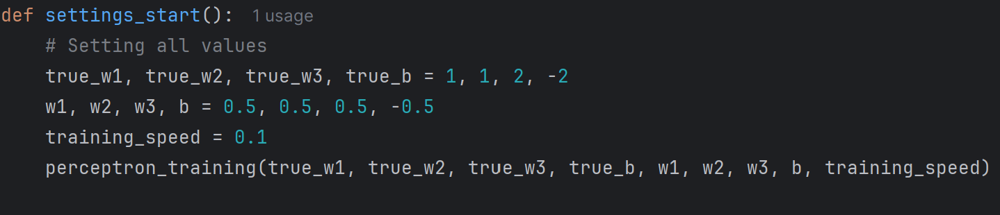

#Single layer Perceptron model
One of the easiest ANN(Artificial Neural Networks) types consists of a feed-forward network and includes a threshold transfer inside the model.\n The main objective of the single-layer perceptron model is to analyze the linearly separable objects with binary outcomes.

##Usage
In settings_start you can change prioroty of values to adjust right output for yourself.

#Explanation of model

A single-layer perceptron is a basic neural network model that computes the weighted sum of inputs xi and their corresponding weights wi, compares the result to a threshold b, and outputs:
z = 1 if the weighted sum is greater than or equal to the threshold
z = 0 if the weighted sum is less than the threshold
It uses a simple linear decision boundary to classify data.

Thats my first neural model, I`d like to hear your thoughts and advices)
